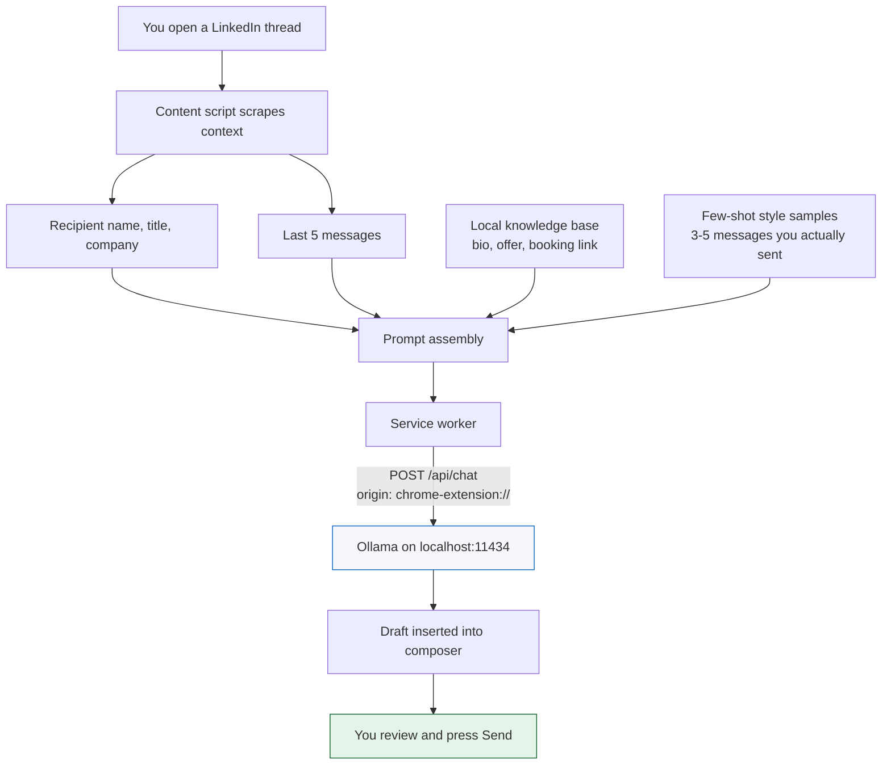

# Local LinkedIn AI Assistant

A Chrome extension that drafts LinkedIn DM replies using a language model running
on your own machine. No API keys, no cloud inference, no telemetry — the only
network request it makes is to `localhost`.

It reads the thread you're looking at, writes a reply in your voice, and puts it
in the composer. **You** press Send. It cannot send for you, by design.

It also carries keyboard shortcuts for inbox triage — toggling LinkedIn's unread
filter and walking down the conversation list without the mouse.

---

## Contents

- [Why this exists](#why-this-exists)
- [How it works](#how-it-works)
- [Requirements](#requirements)
- [Installation](#installation)
- [Daily use](#daily-use)
- [Configuration reference](#configuration-reference)
- [Managing the Ollama process](#managing-the-ollama-process)
- [Safety model](#safety-model)
- [Privacy](#privacy)
- [Troubleshooting](#troubleshooting)

**Further reading**

- [Architecture](docs/architecture.md) — module layout, and the tiered selector
  system that keeps this working when LinkedIn restyles
- [Testing and performance](docs/testing.md) — the browser fixtures and what they
  cover, plus measured latency and memory
- [Roadmap](docs/roadmap.md) — deferred features, and the Antler Hub side panel
  blocked on credentials

---

## Why this exists

LinkedIn DMs are a triage problem. Most inbound is cold pitches, recruiter spam,
and warm leads that deserve two sentences and a booking link. Existing AI reply
tools send your private messages to someone else's server.

This runs a 3-billion-parameter model on your laptop. Your messages never leave
the machine, and a draft costs nothing per call.

The triage shortcuts exist for the same reason: most of the work is deciding
which threads deserve a reply at all, and that is faster from the keyboard.

---

## How it works



The service worker is not an arbitrary indirection. A content script's `fetch`
carries LinkedIn's origin (`https://www.linkedin.com`), which Ollama rejects. The
worker's origin is `chrome-extension://<id>`, which matches
`OLLAMA_ORIGINS="chrome-extension://*"`. Routing through it is what makes the CORS
configuration correct.

---

## Requirements

| | |
| --- | --- |
| macOS | tested on Darwin 25.x; the native host is macOS-specific |
| Chrome | or any Chromium browser (Chromium, Brave, Chrome Canary) |
| [Ollama](https://ollama.com) | `brew install ollama` |
| Python 3 | for the native messaging host and `scripts/apply_env.py` — any 3.8+ |

No Node, no npm, no bundler. The extension is plain ES2020 JavaScript loaded
directly by Chrome. For the file layout and how the selector fallbacks work, see
[docs/architecture.md](docs/architecture.md).

---

## Installation

### 1. Install Ollama and pull a model

```bash
brew install ollama
ollama pull qwen2.5:3b
```

Optionally pull the lighter fallback the watchdog offers when generation is slow:

```bash
ollama pull qwen2.5:1.5b
```

You do **not** need to start the server by hand — see
[Managing the Ollama process](#managing-the-ollama-process).

### 2. Load the extension

1. Open `chrome://extensions`
2. Enable **Developer mode** (top right)
3. **Load unpacked** → select this repository's folder (the one with `manifest.json`)

Do not use "Pack extension". A `.crx` gets a different extension ID, which breaks
the native host registration in the next step.

### 3. Register the native messaging host

```bash
python3 native/install_host.py
```

This copies the host to `~/Library/Application Support/LinkedInAIAssistant/` and
registers that path with every Chromium browser it finds.

> **Why the copy matters.** Chrome cannot exec a native host out of `~/Downloads`,
> `~/Desktop` or `~/Documents` — macOS TCC protects those directories, the exec
> fails, and Chrome reports only the unhelpful *"Native host has exited."*

Re-run this script after **either** of:

- **moving the extension folder** — an unpacked extension's ID is derived from the
  SHA-256 of its absolute path, and the host manifest whitelists that ID
- **editing `native/ollama_launcher.py`** — the installed copy is a snapshot

The script prints the ID it computed. If it disagrees with what
`chrome://extensions` shows, re-run it with the real one:

```bash
python3 native/install_host.py <id-from-chrome>
```

### 4. Add your own configuration

```bash
cp .env.example .env
# put your booking link in .env, then:
python3 scripts/apply_env.py
```

A Chrome extension cannot read a `.env` file — there is no filesystem access from
a content script or service worker. So `.env` is a build-time source:
`apply_env.py` compiles it into `config.local.json`, which the service worker
fetches out of its own package on install and uses to seed settings.

**Both `.env` and `config.local.json` are gitignored.** Nothing personal is in the
repository — `defaults.js` ships an empty booking link, and a clone with no `.env`
simply starts blank.

Seeded values only fill a setting you have never set. Once you save anything in
the popup or options page, your saved value wins and `.env` is ignored. Re-run
`apply_env.py` and reload the extension after editing `.env`.

### 5. Fill in your settings

Click the extension icon → **Settings**.

The single highest-leverage field is **Style samples**: paste 3–5 messages you
have genuinely sent on LinkedIn, one per line. Without them the model writes
generic LinkedIn-ese regardless of size. This field matters more than the model
you choose.

---

## Daily use

Open a LinkedIn message thread. A bar appears above the composer.

| Control | Hotkey | Effect |
| --- | --- | --- |
| **Draft reply** | — | scrape the thread, generate, **replace** composer contents |
| **Regenerate** | — | different angle, different opening (enabled after the first draft) |
| **Add meeting link** | `Alt + M` | **append** your booking link at the cursor, draft untouched |
| *(unread filter)* | `Alt + F` | toggle LinkedIn's Unread filter on and off |
| *(next conversation)* | `Alt + D` | move to the next conversation below the active one |
| *(watchdog)* | — | appears only when generation is slow: retry on the lighter model |

`Alt + F`, `Alt + D` and `Alt + M` are the keyboard shortcuts. Drafting and
regenerating are button-only.

**These are browser-level commands**, registered in the manifest and delivered to
the extension by Chrome — LinkedIn cannot intercept them. Remap any of them at
`chrome://extensions/shortcuts`; the reminder bubble shows whatever is bound.

> An in-page key listener remains as a fallback, on `window` in the capture phase
> so a page listener on `document` cannot pre-empt it. When both fire for one
> keystroke the second is ignored within 400ms, so an action never runs twice.
> Handling keys in the page alone was the earlier design and it failed: LinkedIn
> registers its own capture-phase listeners, and the shortcut fell through to the
> composer as a plain character (`∂` for ⌥D, `ƒ` for ⌥F).

Unlike the other two, `Alt + M` is not restricted to `/messaging` — LinkedIn's
overlay composer appears on other pages, and pasting the link there is just as
useful.

Drafting replaces; the meeting link appends, inserting a single separating space
only when one is needed.

### Unread triage

`Alt + F` (⌥F) flips LinkedIn's own **Unread** filter on and off, for mouse-free
inbox triage. It resolves the filter control through the same tiered selector
system as everything else, and falls back to driving `?filter=unread` on the URL
if LinkedIn's markup has moved.

> **Why not ⌘U or ⌥U.** ⌘U was the original request, but Chrome binds it to View
> Source on macOS and pages cannot reliably cancel browser accelerators. ⌥U was
> the next choice and turned out to be worse: it is one of macOS's Option dead
> keys, so with the caret in the composer it types `¨` instead of firing. Every
> binding now avoids the dead keys — `e`, `i`, `n`, `u` and backtick.

### Conversation navigation

> **Why not ⌥N.** Same reason as above — ⌥N is the tilde dead key, and typed `˜`
> into the composer rather than navigating. ⌥D produces `∂`, an ordinary
> character that `preventDefault()` suppresses cleanly.

`Alt + D` (⌥D) selects the next conversation **below** the active one — the next
oldest, since LinkedIn sorts most-recent-first — for working down the inbox
without the mouse.

**Rows are the thread links themselves**, not their containers. LinkedIn has
rewrapped conversation rows repeatedly — `li.msg-conversation-listitem`, then
divs, then something else — and on the current layout every container selector
matched nothing at all. The `a[href*="/messaging/thread/"]` inside a row is the
stable part: it identifies the conversation, it is what gets compared against the
URL, and it is what gets clicked. Container selectors remain only as a fallback
for a layout with no thread anchors.

Finding which row is currently open is the fragile part. Three strategies, in
order:

1. **The URL.** `/messaging/thread/<id>/` carries the open thread's id; if rows
   link to threads, the row pointing at that id is the active one. Independent of
   CSS classes — but the current layout has no thread anchors at all, so this
   strategy sits idle there.
2. `aria-current` on the row or a descendant.
3. An active-marker class **anywhere inside the row**, matched loosely:
   `[class*="--active"]`, `[class*="is-selected"]`, `[class*="is-active"]`.
   LinkedIn puts `msg-conversations-container__convo-item-link--active` on the
   row's inner link, not on the row or its first child — checking only those two
   found nothing, every press reopened row 0, and the symptom read as the list
   scrolling upward.

If all three miss, it advances from the last row it moved to rather than falling
back to the top of the list. Without that, a detection failure makes every press
reopen the newest conversation — which looks like the list scrolling *up*.

It **stops at the last conversation** rather than wrapping, and opens the first
row if nothing is selected and nothing has been navigated yet.

After moving, the caret is returned to the composer of the newly opened thread so
you can start typing immediately. It waits for the thread id in the URL to change
before focusing — focusing sooner would land on the outgoing thread's composer —
and focuses anyway after 2.5s if the URL never changes.

### Why the bar sometimes did not appear

Worth recording, because the failure was intermittent and the cause was not where
it looked. The button bar is mounted on load and re-mounted from a
`MutationObserver`, which was a plain 300ms debounce. LinkedIn mutates the DOM
continuously — presence dots, typing indicators, lazy images, the virtualised
conversation list — so every tick reset the timer and it could **never** fire. If
the first `mount()` ran before the composer had rendered, nothing ever retried.

The observer now debounces with a **max wait**: 300ms of quiet, but a guaranteed
run at least once a second however busy the page is. Reproduced and fixed under a
simulated mutation storm — the old scheduler ran 0 times in 3 seconds, the new one
ran twice.

### Changing the meeting link

Two ways in, both writing the same `bookingLink` setting:

- **`.env`** — `BOOKING_LINK=…` then `python3 scripts/apply_env.py`. Seeds the
  setting on a fresh install. Good for a first run or a new machine.
- **The popup** — a **Meeting link** field under DOM diagnostics showing the link
  currently in use. Edit, press **Save** or Enter, effective immediately. The same
  field is on the options page.

A saved value always beats `.env`, which only fills a setting never set.

Only an absolute `http(s)` URL is accepted — a bare `cal.com/you` would paste into
the composer as broken text. Clearing the field is allowed and disables the
feature; the popup says so rather than leaving you guessing.

> Clearing it really clears it. The paste path used to fall back to the link
> shipped in `defaults.js`, so a second user who cleared the field would silently
> keep pasting the original author's link. There is no fallback now, and no link
> ships in the repository at all.

### Shortcut reminder

A single bubble carries every shortcut, one per row, with the unread filter's
live state:

```
⌥f unread [on]      ×
⌥d next conversation
⌥m meeting link
─────────────────────
⌘↩ send (LinkedIn)
```

The last row is a **reminder only**. ⌘↩ is LinkedIn's own shortcut; the extension
does not bind it and must never bind it — see [Safety model](#safety-model). It is
ruled off and muted so it reads as not-ours. Note that LinkedIn's "Press Enter to
send" preference changes which key sends: with that setting on, plain Enter sends
instead.

It is pinned to the left edge of the browser window, near the top
(`left: 16px, top: 100px`). Fixed positioning, so it stays put as the
conversation list and thread scroll independently.

Dismiss it with the ×; re-enable under **Show the shortcut reminder bubble** in
Settings. Like all injected UI it lives in a shadow root, so LinkedIn's CSS
cannot affect it and vice versa.

---

## Configuration reference

All settings live in `chrome.storage.local` and are edited on the options page.

### Engine

| Setting | Default | Notes |
| --- | --- | --- |
| `endpoint` | `http://localhost:11434` | the native host binds `OLLAMA_HOST` to match |
| `model` | `qwen2.5:3b` | any model `ollama list` shows |
| `lightModel` | `qwen2.5:1.5b` | offered by the watchdog when generation drags |
| `watchdogMs` | `2500` | when to offer the lighter model |
| `hardTimeoutMs` | `20000` | abort generation entirely |
| `keepAlive` | `5m` | how long Ollama holds the model in RAM |

### Knowledge base

| Setting | Injected into the prompt as |
| --- | --- |
| `name`, `company` | who the reply is from |
| `bio` | "About you" |
| `offer` | used when someone asks what you do |
| `bookingLink` | what **Add meeting link** / `⌥M` pastes, and offered to the model when a draft proposes a meeting. Empty by default; set it in `.env`, the popup, or here |

### Voice

| Setting | Notes |
| --- | --- |
| `guidelines` | hard rules, e.g. "under 3 sentences", "no em dashes" |
| `styleSamples` | few-shot examples. **Do not skip this.** |

### Process management

| Setting | Default | Notes |
| --- | --- | --- |
| `autoStartOllama` | on | start the server when you open LinkedIn Messages |
| `autoStopOllama` | on | stop it when no LinkedIn tab remains |
| `autoStopGraceMin` | `5` | 1 minute is the practical floor (MV3 workers sleep) |
| `showShortcutHint` | on | the shortcut bubble, pinned to the window's left edge |
| `debug` | off | logs scraped context and matched selectors to the tab console |

---

## Managing the Ollama process

The extension owns the server's lifecycle so you never touch a terminal.

**Starting.** When you open LinkedIn Messages the content script pings the
endpoint and, if nothing answers, asks the native host to spawn `ollama serve`
with `OLLAMA_ORIGINS="chrome-extension://*"` and `OLLAMA_HOST` set to your
configured endpoint. The popup also has a **Start Ollama** button.

**Stopping.** Two independent levers:

- **`keepAlive`** controls how long the model stays in RAM after a draft
- **`autoStopOllama`** stops the server itself once no LinkedIn tab is open, after
  a grace period. Reopening LinkedIn during the grace window cancels the pending
  stop.

Measured on an M-series Mac with `qwen2.5:3b`:

| State | Memory |
| --- | --- |
| Drafting (model resident) | ~2.2 GB |
| Idle, LinkedIn open, after `keepAlive` expiry | ~26 MB |
| LinkedIn closed, past the grace period | 0 — process gone |

**The safety property:** the host records the pid of the server *it* started and
will only ever kill that pid. A server you launched by hand, or one Homebrew
manages, is never touched — `stop` reports
`"No server recorded as started by this extension"` instead.

---

## Safety model

**The extension cannot send a message.** This is an invariant, documented at the
top of `src/content.js`:

- it never clicks LinkedIn's Send button
- it never dispatches `Enter`/`keypress` into the composer
- it never calls `form.submit()`

Text is placed via `execCommand('insertText')` — which fires the `input` events
LinkedIn's editor listens for — and stops there. Every message requires a
deliberate human action.

The two places the extension clicks a LinkedIn control are the unread filter and
the conversation list. Both route through a single predicate,
`looksLikeSendControl()`, and refuse outright if the resolved element's label
matches `send` on a word boundary — so a mis-bound selector override cannot turn
navigation into a send. Keep that one definition: it previously existed twice and
the two copies drifted apart.

The bubble's `⌘↩ send` row is a label only. The extension does not bind it and
must not: that shortcut belongs to LinkedIn, and the human pressing it is the
whole point.

If you extend this code, keep it that way. Automated sending is the difference
between a drafting aid and a spam cannon, and it is also what gets LinkedIn
accounts restricted.

---

## Privacy

- **No external network calls.** `host_permissions` is limited to
  `http://localhost:11434/*` and `https://www.linkedin.com/*`. There is no
  analytics, no error reporting, no remote config.
- **No remote selector fetching.** An earlier design allowed updating DOM
  selectors from a hosted JSON file. It was dropped because it contradicted the
  privacy claim. Selector overrides are local only.
- **Your messages never leave the machine.** Scraped context goes to
  `localhost:11434` and nowhere else.
- **Storage is local.** `chrome.storage.local`, not `chrome.storage.sync` — your
  bio and style samples are not pushed through your Google account.
- **Nothing personal is committed.** `.env` and the generated `config.local.json`
  are gitignored, and the repository ships no booking link, name, or company.

---

## Troubleshooting

### Getting a diagnostic report

Open the popup and press **Copy diagnostics**. That puts a JSON report on the
clipboard: extension version, engine status, every selector's resolution, the
conversation rows with what would be clicked in each, and the unread control.

Prefer this to the console. `LLA` lives in the content script's **isolated
world**, so it is not defined in the DevTools console by default — evaluating
`LLA.debugNav()` there gives *"LLA is not defined"* unless you first switch the
Console's context dropdown from `top` to the extension. The button avoids that
entirely.

> Unrelated noise worth ignoring: LinkedIn's own bundle fetches
> `chrome-extension://invalid/` repeatedly, interleaved with its `sensorCollect`
> telemetry — it appears to be fingerprinting installed extensions. Those failed
> requests are not from this extension, which makes no page-context fetches at
> all. Filter the Network panel with `-invalid`, or use the Console with `[LLA]`.

### "Native host has exited"

The host process died before replying. Check the trace log:

```bash
tail -20 ~/Library/Logs/lla-ollama.log
```

- **Lines present** → the host ran; the message says what failed.
- **No lines at all** → Chrome never launched it. Re-run
  `python3 native/install_host.py` and check the printed ID against
  `chrome://extensions`.

Most common cause: the host being exec'd from a TCC-protected directory. The
installer avoids this by copying out of the extension folder.

### 403 from Ollama, or "Not running" despite a running server

Something started `ollama serve` without `OLLAMA_ORIGINS`, so it rejects the
extension's origin. Usually Homebrew:

```bash
brew services stop ollama
```

That plist restarts the server on login without the variable, and wins any
`pkill` race. Stop the service and let the extension manage its own.

Verify the fix — this should echo your extension's origin back:

```bash
curl -s -i -X OPTIONS http://localhost:11434/api/chat \
  -H "Origin: chrome-extension://YOUR_EXTENSION_ID" \
  -H "Access-Control-Request-Method: POST" | grep -i access-control-allow-origin
```

### "Model missing"

The popup names the model and lists what is installed. Pull it, or change
**Model** in Settings to one you have.

### "Extension context invalidated"

That tab's content script was orphaned by an extension reload. It should
self-heal via the teardown handshake; if the message persists, reload the tab.

### The button bar does not appear

Check the popup's **Compose box (UI anchor)** row. FAILED means the selector needs
rebinding — hit **Pick** and click LinkedIn's compose box.

If it says OK and the bar is still missing, reload the tab. An earlier version
could miss the mount entirely on a busy page; see
[Why the bar sometimes did not appear](#why-the-bar-sometimes-did-not-appear).

### A shortcut types a character instead of firing

`˜` from ⌥D, `¨` from ⌥F, `µ` from ⌥M. macOS treats those combinations as dead
keys for accent composition, and with the caret in the composer the character can
arrive through the composition path, which `preventDefault()` on `keydown` does
not always suppress.

Claiming a hotkey now opens a 250ms window in which a stray dead-key insertion is
cancelled. Ordinary typing is unaffected, including typing those characters
deliberately when no shortcut was pressed.

If it still happens, confirm what the page is actually receiving:

```js
LLA.probeKeys()
```

then press the shortcut. Each `keydown` and `beforeinput` is logged with `key`,
`code`, the modifiers, `defaultPrevented` and the focused element. If no
`keydown` appears at all, the content script is not loaded in that tab — check
for `[LLA] v… ready` and reload the extension, not just the page.

### ⌥D opens a profile, or goes nowhere

The row was right, the element clicked inside it was not. A LinkedIn conversation
row contains the avatar's profile link *before* the thread link, so taking the
first anchor navigated to `/in/<someone>`. It now clicks
`a[href*="/messaging/thread/"]` specifically, and rows are filtered to those that
carry such a link — which also stops the broadest selector tier
(`div[role="main"] ul li`) treating an unrelated list as conversations.

```js
LLA.debugNav()
```

Reports the matched selector, how many rows are usable, which is active, and per
row: the thread href, the *first* anchor's href, and what would actually be
clicked. If `wouldClick` is not a `/messaging/thread/` URL, that is the bug.

### The unread filter does nothing, or marks a thread unread

`⌥f` resolves LinkedIn's own filter control. Three things can go wrong, and one
diagnostic distinguishes them — paste this into the console on a messaging page:

```js
LLA.debugUnread()
```

It reports the resolved control, whether a filter dropdown was found, and every
candidate on the page with its label, visibility and pressed state.

- **`resolved: null`, `filterTrigger: null`** — neither the control nor a dropdown
  is on the page. Use the popup's **Pick** on the *Unread filter* row.
- **It clicks the wrong filter** — "Jobs", "Focused", or LinkedIn's per-row *Mark
  as unread*. Every selector tier is anchored on a label starting with "Unread"
  now, and every hit is validated against that label — **including a user
  override from the picker**, which used to be trusted blindly. A selector that
  resolves to the wrong control is refused with a console warning naming what it
  found, rather than clicking it. The popup's diagnostics show which control
  resolved, so a wrong binding is visible at a glance.
- **`resolved` looks right but nothing happens** — the control is probably inside
  a closed menu. `⌥f` opens the filter dropdown and retries automatically before
  falling back to `?filter=unread`.

### "No meeting link set"

Nothing is stored in `bookingLink`. Set it in the popup's **Meeting link** field,
or in `.env` followed by `python3 scripts/apply_env.py` and an extension reload.
No link ships with the repository, so this is expected on a fresh clone.

### Drafts attribute messages to the wrong person

The sender heuristic in `src/scraper.js` relies on LinkedIn's `--other` class
modifier, with a sender-name fallback. Enable **Verbose console logging** in
Settings and inspect the `[LLA] scraped context` line in the tab's console.

### Drafts sound generic

Fill in **Style samples**. This is almost always the cause.

---

## License

MIT. See [LICENSE](LICENSE).
