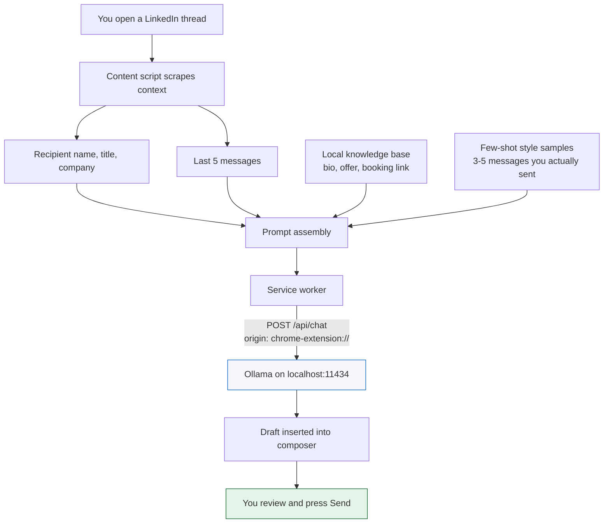

# Local LinkedIn AI Assistant

A Chrome extension that drafts LinkedIn DM replies using a language model running
on your own machine. No API keys, no cloud inference, no telemetry — the only
network request it makes is to `localhost`.

It reads the thread you're looking at, writes a reply in your voice, and puts it
in the composer. **You** press Send. It cannot send for you, by design.

---

## Contents

- [Why this exists](#why-this-exists)
- [How it works](#how-it-works)
- [Requirements](#requirements)
- [Installation](#installation)
- [Daily use](#daily-use)
- [Configuration reference](#configuration-reference)
- [Managing the Ollama process](#managing-the-ollama-process)
- [Safety model](#safety-model)
- [Privacy](#privacy)
- [DOM resilience](#dom-resilience)
- [Architecture](#architecture)
- [Troubleshooting](#troubleshooting)
- [Testing](#testing)
- [Performance notes](#performance-notes)
- [Not built yet](#not-built-yet)
- [Future integrations](#future-integrations)

---

## Why this exists

LinkedIn DMs are a triage problem. Most inbound is cold pitches, recruiter spam,
and warm leads that deserve two sentences and a booking link. Existing AI reply
tools send your private messages to someone else's server.

This runs a 3-billion-parameter model on your laptop. Your messages never leave
the machine, and a draft costs nothing per call.

---

## How it works



The service worker is not an arbitrary indirection. A content script's `fetch`
carries LinkedIn's origin (`https://www.linkedin.com`), which Ollama rejects. The
worker's origin is `chrome-extension://<id>`, which matches
`OLLAMA_ORIGINS="chrome-extension://*"`. Routing through it is what makes the CORS
configuration correct.

---

## Requirements

| | |
| --- | --- |
| macOS | tested on Darwin 25.x; the native host is macOS-specific |
| Chrome | or any Chromium browser (Chromium, Brave, Chrome Canary) |
| [Ollama](https://ollama.com) | `brew install ollama` |
| Python 3 | for the native messaging host — any 3.8+ |

No Node, no npm, no bundler. The extension is plain ES5/ES2020 JavaScript loaded
directly by Chrome.

---

## Installation

### 1. Install Ollama and pull a model

```bash
brew install ollama
ollama pull qwen2.5:3b
```

Optionally pull the lighter fallback the watchdog offers when generation is slow:

```bash
ollama pull qwen2.5:1.5b
```

You do **not** need to start the server by hand — see
[Managing the Ollama process](#managing-the-ollama-process).

### 2. Load the extension

1. Open `chrome://extensions`
2. Enable **Developer mode** (top right)
3. **Load unpacked** → select this repository's folder (the one with `manifest.json`)

Do not use "Pack extension". A `.crx` gets a different extension ID, which breaks
the native host registration in the next step.

### 3. Register the native messaging host

```bash
python3 native/install_host.py
```

This copies the host to `~/Library/Application Support/LinkedInAIAssistant/` and
registers that path with every Chromium browser it finds.

> **Why the copy matters.** Chrome cannot exec a native host out of `~/Downloads`,
> `~/Desktop` or `~/Documents` — macOS TCC protects those directories, the exec
> fails, and Chrome reports only the unhelpful *"Native host has exited."*

Re-run this script after **either** of:

- **moving the extension folder** — an unpacked extension's ID is derived from the
  SHA-256 of its absolute path, and the host manifest whitelists that ID
- **editing `native/ollama_launcher.py`** — the installed copy is a snapshot

The script prints the ID it computed. If it disagrees with what
`chrome://extensions` shows, re-run it with the real one:

```bash
python3 native/install_host.py <id-from-chrome>
```

### 4. Fill in your settings

Click the extension icon → **Settings**.

The single highest-leverage field is **Style samples**: paste 3–5 messages you
have genuinely sent on LinkedIn, one per line. Without them the model writes
generic LinkedIn-ese regardless of size. This field matters more than the model
you choose.

---

## Daily use

Open a LinkedIn message thread. A bar appears above the composer.

| Control | Hotkey | Effect |
| --- | --- | --- |
| **Draft reply** | — | scrape the thread, generate, **replace** composer contents |
| **Regenerate** | — | different angle, different opening (enabled after the first draft) |
| **Add meeting link** | — | **append** your booking link at the cursor, draft untouched |
| *(unread filter)* | `Alt + U` | toggle LinkedIn's Unread filter on and off |
| *(next conversation)* | `Alt + N` | move to the next conversation below the active one |
| *(watchdog)* | — | appears only when generation is slow: retry on the lighter model |

`Alt + U` and `Alt + N` are the only keyboard shortcuts. Drafting and
regenerating are button-only.

Drafting replaces; the meeting link appends, inserting a single separating space
only when one is needed.

### Unread triage

`Alt + U` (⌥U) flips LinkedIn's own **Unread** filter on and off, for mouse-free
inbox triage. It resolves the filter control through the same tiered selector
system as everything else, and falls back to driving `?filter=unread` on the URL
if LinkedIn's markup has moved.

> ⌘U was the original request, but Chrome binds it to View Source on macOS and
> pages cannot reliably cancel browser accelerators, so ⌥U is used instead.

### Conversation navigation

`Alt + N` (⌥N) selects the next conversation **below** the active one — the next
oldest, since LinkedIn sorts most-recent-first — for working down the inbox
without the mouse.

Finding which row is currently open is the fragile part. Three strategies, in
order:

1. **The URL.** `/messaging/thread/<id>/` carries the open thread's id; the row
   whose link points at that id is the active one. Independent of CSS classes,
   so this survives LinkedIn restyling.
2. `aria-current` on the row or a descendant.
3. LinkedIn's `--is-selected` / `active` class names.

If all three miss, it advances from the last row it moved to rather than falling
back to the top of the list. Without that, a detection failure makes every press
reopen the newest conversation — which looks like the list scrolling *up*.

It **stops at the last conversation** rather than wrapping, and opens the first
row if nothing is selected and nothing has been navigated yet.

### Shortcut reminder

A single bubble carries every shortcut, one per row, with the unread filter's
live state:

```
⌥U unread [on]      ×
⌥N next conversation
```

It is pinned to the left edge of the browser window, near the top
(`left: 16px, top: 100px`). Fixed positioning, so it stays put as the
conversation list and thread scroll independently.

Dismiss it with the ×; re-enable under **Show the shortcut reminder bubble** in
Settings. Like all injected UI it lives in a shadow root, so LinkedIn's CSS
cannot affect it and vice versa.

---

## Configuration reference

All settings live in `chrome.storage.local` and are edited on the options page.

### Engine

| Setting | Default | Notes |
| --- | --- | --- |
| `endpoint` | `http://localhost:11434` | the native host binds `OLLAMA_HOST` to match |
| `model` | `qwen2.5:3b` | any model `ollama list` shows |
| `lightModel` | `qwen2.5:1.5b` | offered by the watchdog when generation drags |
| `watchdogMs` | `2500` | when to offer the lighter model |
| `hardTimeoutMs` | `20000` | abort generation entirely |
| `keepAlive` | `5m` | how long Ollama holds the model in RAM |

### Knowledge base

| Setting | Injected into the prompt as |
| --- | --- |
| `name`, `company` | who the reply is from |
| `bio` | "About you" |
| `offer` | used when someone asks what you do |
| `bookingLink` | only when the reply proposes a meeting — also what the **Add meeting link** button pastes |

### Voice

| Setting | Notes |
| --- | --- |
| `guidelines` | hard rules, e.g. "under 3 sentences", "no em dashes" |
| `styleSamples` | few-shot examples. **Do not skip this.** |

### Process management

| Setting | Default | Notes |
| --- | --- | --- |
| `autoStartOllama` | on | start the server when you open LinkedIn Messages |
| `autoStopOllama` | on | stop it when no LinkedIn tab remains |
| `autoStopGraceMin` | `5` | 1 minute is the practical floor (MV3 workers sleep) |
| `showShortcutHint` | on | the shortcut bubble, pinned to the window's left edge |
| `debug` | off | logs scraped context and matched selectors to the tab console |

---

## Managing the Ollama process

The extension owns the server's lifecycle so you never touch a terminal.

**Starting.** When you open LinkedIn Messages the content script pings the
endpoint and, if nothing answers, asks the native host to spawn `ollama serve`
with `OLLAMA_ORIGINS="chrome-extension://*"` and `OLLAMA_HOST` set to your
configured endpoint. The popup also has a **Start Ollama** button.

**Stopping.** Two independent levers:

- **`keepAlive`** controls how long the model stays in RAM after a draft
- **`autoStopOllama`** stops the server itself once no LinkedIn tab is open, after
  a grace period. Reopening LinkedIn during the grace window cancels the pending
  stop.

Measured on an M-series Mac with `qwen2.5:3b`:

| State | Memory |
| --- | --- |
| Drafting (model resident) | ~2.2 GB |
| Idle, LinkedIn open, after `keepAlive` expiry | ~26 MB |
| LinkedIn closed, past the grace period | 0 — process gone |

**The safety property:** the host records the pid of the server *it* started and
will only ever kill that pid. A server you launched by hand, or one Homebrew
manages, is never touched — `stop` reports
`"No server recorded as started by this extension"` instead.

---

## Safety model

**The extension cannot send a message.** This is an invariant, documented at the
top of `src/content.js`:

- it never clicks LinkedIn's Send button
- it never dispatches `Enter`/`keypress` into the composer
- it never calls `form.submit()`

Text is placed via `execCommand('insertText')` — which fires the `input` events
LinkedIn's editor listens for — and stops there. Every message requires a
deliberate human action.

The two places the extension clicks a LinkedIn control are the unread filter and
the conversation list. Both check the resolved element's label first and refuse
outright if it looks like a send control, so a mis-bound selector override cannot
turn navigation into a send.

If you extend this code, keep it that way. Automated sending is the difference
between a drafting aid and a spam cannon, and it is also what gets LinkedIn
accounts restricted.

---

## Privacy

- **No external network calls.** `host_permissions` is limited to
  `http://localhost:11434/*` and `https://www.linkedin.com/*`. There is no
  analytics, no error reporting, no remote config.
- **No remote selector fetching.** An earlier design allowed updating DOM
  selectors from a hosted JSON file. It was dropped because it contradicted the
  privacy claim. Selector overrides are local only.
- **Your messages never leave the machine.** Scraped context goes to
  `localhost:11434` and nowhere else.
- **Storage is local.** `chrome.storage.local`, not `chrome.storage.sync` — your
  bio and style samples are not pushed through your Google account.

---

## DOM resilience

LinkedIn changes its CSS class names without warning. Three stages of defence:

**1. Tiered selectors.** Every element has an ordered candidate list in
`src/defaults.js` — current CSS classes first, then semantic ARIA and structural
attributes that survive class churn:

```js
chatInput: [
  'div.msg-form__contenteditable[contenteditable="true"]',   // tier 0: current classes
  'form.msg-form div[contenteditable="true"][role="textbox"]', // tier 1: structural
  'div[contenteditable="true"][role="textbox"]'               // tier 2: semantic only
]
```

**2. Diagnostics.** The popup shows every element as **OK** or **FAILED**, plus
which tier matched — so you can see degradation before it becomes breakage.

**3. Element picker.** For anything FAILED, click **Pick**, then click the real
element on the page. The extension generates a selector, verifies uniqueness,
saves it to `chrome.storage.local`, and tries it ahead of all built-in tiers.
Clear overrides from Settings.

---

## Architecture

```
manifest.json          MV3 manifest — permissions, content scripts, icons
src/
  defaults.js          default settings + the tiered selector table
  selectors.js         override-aware resolution, diagnostics snapshot
  scraper.js           recipient metadata + last 5 messages
  prompt.js            prompt assembly, model-output cleanup
  background.js        Ollama client, watchdog, native host, idle shutdown
  content.js           shadow-DOM UI, hotkeys, composer insertion
  picker.js            element picker overlay
  popup.html/.js       diagnostics panel, start/stop controls
  options.html/.js     knowledge base + engine configuration
native/
  ollama_launcher.py   native messaging host: status / start / stop
  install_host.py      registers the host, computes the extension ID
test/
  composer-fixture.html  contenteditable harness for insertion behaviour
  messaging/index.html   unread-filter toggle harness (must be served at /messaging/)
icons/                 16/32/48/128, generated from a 2048px source
```

### Notes on structure

**Content scripts share a global, not ES modules.** MV3 content scripts cannot be
ES modules, so the six files are listed in order in the manifest and communicate
through a `globalThis.LLA` namespace. Load order matters.

**Shadow DOM isolation.** All injected UI lives in a shadow root with
`all: initial`, so LinkedIn's stylesheet cannot leak in and the extension's CSS
cannot leak out.

**Instance handover.** After an extension reload, the service worker re-injects
into open LinkedIn tabs. Each instance publishes `globalThis.__LLA_TEARDOWN`; the
next one calls it to disconnect observers, drop listeners, and strip the stale UI
before mounting. Without this, an orphaned script sits on the page throwing
*"Extension context invalidated"* on every keystroke.

---

## Troubleshooting

### "Native host has exited"

The host process died before replying. Check the trace log:

```bash
tail -20 ~/Library/Logs/lla-ollama.log
```

- **Lines present** → the host ran; the message says what failed.
- **No lines at all** → Chrome never launched it. Re-run
  `python3 native/install_host.py` and check the printed ID against
  `chrome://extensions`.

Most common cause: the host being exec'd from a TCC-protected directory. The
installer avoids this by copying out of the extension folder.

### 403 from Ollama, or "Not running" despite a running server

Something started `ollama serve` without `OLLAMA_ORIGINS`, so it rejects the
extension's origin. Usually Homebrew:

```bash
brew services stop ollama
```

That plist restarts the server on login without the variable, and wins any
`pkill` race. Stop the service and let the extension manage its own.

Verify the fix — this should echo your extension's origin back:

```bash
curl -s -i -X OPTIONS http://localhost:11434/api/chat \
  -H "Origin: chrome-extension://YOUR_EXTENSION_ID" \
  -H "Access-Control-Request-Method: POST" | grep -i access-control-allow-origin
```

### "Model missing"

The popup names the model and lists what is installed. Pull it, or change
**Model** in Settings to one you have.

### "Extension context invalidated"

That tab's content script was orphaned by an extension reload. It should
self-heal via the teardown handshake; if the message persists, reload the tab.

### Drafts attribute messages to the wrong person

The sender heuristic in `src/scraper.js` relies on LinkedIn's `--other` class
modifier, with a sender-name fallback. Enable **Verbose console logging** in
Settings and inspect the `[LLA] scraped context` line in the tab's console.

### Drafts sound generic

Fill in **Style samples**. This is almost always the cause.

---

## Testing

`test/composer-fixture.html` is a standalone harness for the trickiest logic —
caret handling and append-vs-replace insertion into a `contenteditable`.

It needs a real origin; `file://` will not execute the script. Serve it:

```bash
python3 -m http.server 8777 --directory test
```

Then open `http://localhost:8777/composer-fixture.html` and call `runTests()` in
the console. Covered cases:

| Case | Expected |
| --- | --- |
| Link into an empty composer | URL only, one `input` event |
| Draft, then link | single separating space |
| Draft already ends in whitespace | no double space |
| Draft twice | second replaces the first, no append |

`test/messaging/index.html` covers the unread-filter toggle. Serve the `test`
directory as above and open `http://localhost:8777/messaging/` — the path matters,
the code only acts under `/messaging`. Call `runTests()`:

| Case | Expected |
| --- | --- |
| Finds the filter control | resolves via the tiered selectors |
| Toggle on / off | clicks the control, state reads back correctly |
| Mis-bound to a send control | **refused**, nothing clicked |
| No control in the DOM | falls back to `?filter=unread` |

`runNavTests()` on the same page covers `Alt + N`:

| Case | Expected |
| --- | --- |
| URL points at a middle row | moves to the row below |
| URL points at the last row | stops, does not wrap |
| URL points at the first row | moves to the second |
| Detection fails, three presses | walks down three rows, does not reopen the top |

The prompt-assembly layer is testable in plain Node, since it touches no DOM:

```bash
node -e "globalThis.LLA={settings:{guidelines:'Under 3 sentences.',styleSamples:['Thanks for reaching out.']}}; require('./src/prompt.js'); console.log(LLA.buildMessages({recipient:{name:'Alex'},messages:[]},'')[0].content)"
```

---

## Performance notes

Measured with `qwen2.5:3b` on Apple silicon:

| | |
| --- | --- |
| Cold generation (model loading) | ~2.4 s |
| Warm generation | well under 1 s |
| Model footprint while resident | ~2.2 GB |
| Idle server process | 26–48 MB |

The default `watchdogMs` of 2500 sits just above the warm case and just below the
cold one, so your first draft after a pause may offer the lighter model
unnecessarily. Raise it to ~4000 if that annoys you.

---

## Not built yet

From the original spec, deliberately deferred:

- **Suggested message chips** — three drafts offered at once, `Alt + 1/2/3` to pick
- **Visual intent badging** — a single-token classification pass tagging threads
  `[Cold Pitch]`, `[Warm Lead]`, `[Recruiter]`, `[Spam]`

The scraper and prompt layers already return everything both features need.

---

## Future integrations

### Antler Hub side panel

**Status: investigated, blocked on credentials. No code written.**

The idea: a Chrome side panel (`chrome.sidePanel`, MV3) showing Antler Hub records
for whoever is currently in view — the recipient of the open conversation, or the
subject of a `/in/<slug>` profile page — opened by a button beside **Settings** in
the popup, which kicks off the lookup on click. Roughly what the Attio extension
does for its CRM.

The design principle worth keeping: this data is **displayed to the reader, not
injected into the model's prompt**. A wrong match then costs a glance, not a
fabricated draft.

#### What the investigation found

**A browser extension cannot call an MCP server.** MCP connectors are
authenticated, session-bound, and speak stdio/SSE. There is no browser-reachable
endpoint, so any Hub integration needs a bridge process.

**The Hub MCP connector is bound to a Claude session, not to this machine.**

| | |
| --- | --- |
| Authenticated as | `ryan.green@antler.co`, role `OPERATIONS` |
| Lane / scopes | `staff_scoped_read`, `postgres:read` |
| Credentials on disk | none — no API key, no environment variable |

The native messaging host could host a bridge, but it has nothing to
authenticate with. **This is the blocker**: it needs a token-authenticated Hub
endpoint, which is a question for whoever operates Hub, not something that can be
solved from this repo.

Worth noting for whoever picks this up: for a deterministic sidebar you probably
want the API *underneath* Hub's MCP rather than MCP itself. MCP is a wrapper for
model tool-calling; a panel doing "show me this person" lookups wants the source
directly.

#### Coverage and matching are inversely matched

| | Covers | Matches on |
| --- | --- | --- |
| **Hub** | applicants, residency founders, portfolio founders, staff, sourcing leads | name and email only |
| **`antler-search`** (local, port 8000) | 312 companies, 514 founders — 412 with LinkedIn URLs | canonical `/in/<slug>/`, exact |

Hub knows more people; the local database identifies them far more reliably.
Hub's `person_search` returns no LinkedIn field, so a profile-page lookup would
have to match on display name. That is not merely imprecise: a search for a
common first name returned a hit on an unrelated person via an email substring.
Any name-matched result must be shown with its confidence, never presented as
certain.

#### The path that needs no permissions

Extend the existing Harmonic enrichment workflow in `antler-search` to also sync
Hub **leads and applicants** into the local SQLite alongside founders. That buys
Hub's breadth with the local database's slug-matching precision, no runtime
authentication, and no change to the localhost-only privacy property. A live Hub
token would then only be needed for real-time freshness rather than for the
feature to exist at all.

The panel itself is independent of all this — it should be built against a
pluggable data source so the backing store can change without touching the UI.

---

## License

MIT. See [LICENSE](LICENSE).
